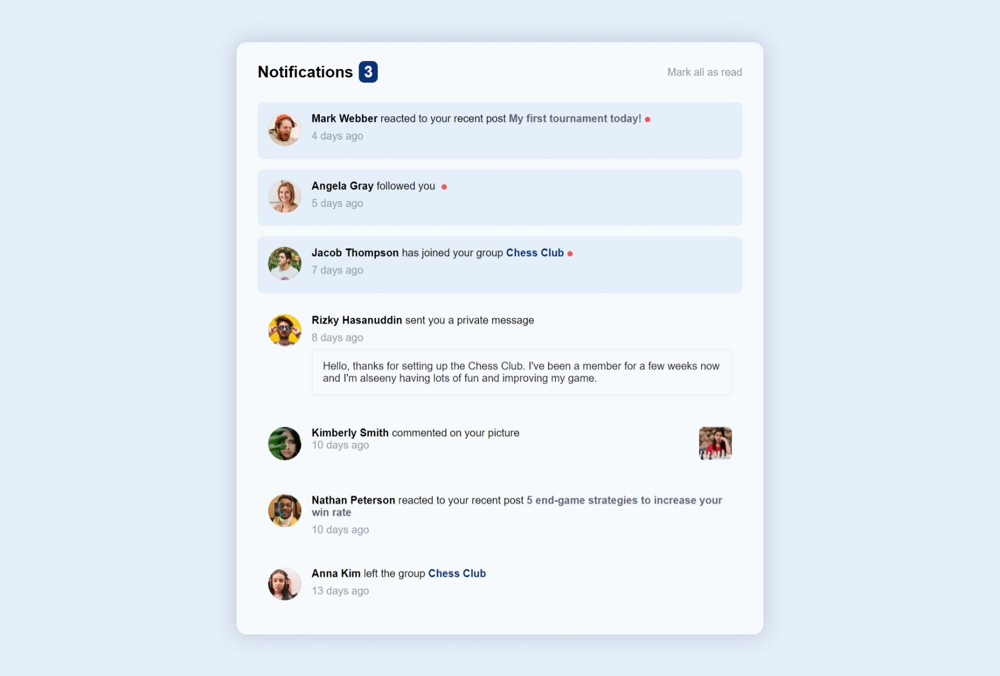

# Frontend Mentor - Notifications page solution

This is a solution to the [Notifications page challenge on Frontend Mentor](https://www.frontendmentor.io/challenges/notifications-page-DqK5QAmKbC). Frontend Mentor challenges help you improve your coding skills by building realistic projects. 

## Table of contents

- [Overview](#overview)
  - [The challenge](#the-challenge)
  - [Screenshot](#screenshot)
  - [Links](#links)
- [My process](#my-process)
  - [Built with](#built-with)
- [Author](#author)

## Overview

### The challenge

Users should be able to:

- Distinguish between "unread" and "read" notifications
- Select "Mark all as read" to toggle the visual state of the unread notifications and set the number of unread messages to zero
- Select one notification to toggle its visual state and decrement the number of unread messages
- View the optimal layout for the interface depending on their device's screen size
- See hover and focus states for all interactive elements on the page

### Screenshot

- Desktop

### Links

- Solution URL: [Github code](https://github.com/salma247/notifications-page)
- Live Site URL: [Notification page](https://salma247.github.io/notifications-page/)

## My process

I did this project using React, I used React Hooks to manage the state of the notfications and the number of unread notifications. I did the styling using SASS. Notifcations are dynamically generated using a JSON file.

### Built with

- Semantic HTML5 markup
- CSS custom properties
- Flexbox
- SASS preprocessor
- Mobile-first workflow
- [React](https://reactjs.org/) - JS library

## Author

- Frontend Mentor - [@salma247](https://www.frontendmentor.io/profile/salma247)

